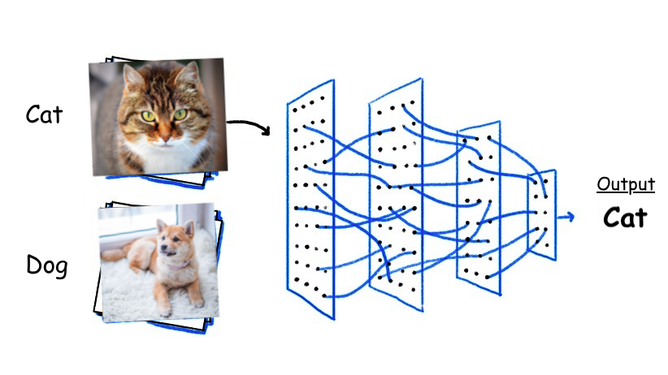
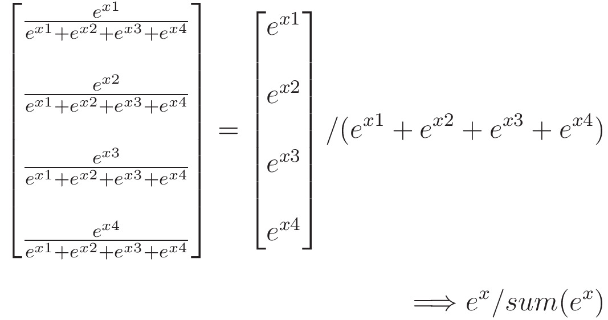
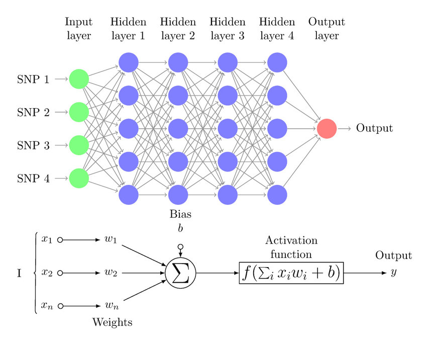

# Mastering Deep Learning Within a Few Hours

Stanley Zheng, CSE, CUHK


## 
- Introduction
- Problem Formulation
- Implementation
- Experiments
- Advanced Topics


---
# Introduction

Artificial v.s. Intelligence


---
## Intelligence

- Human Perception


---
## Artificial

- Machine Learning


---
## Deep Learning


---
### What Can Deep Learning Do?

- Classification
- What is this?




---
### What Can Deep Learning Do?

- Objective Detection
- Where is it?


---
### What Can Deep Learning Do?

- Semantic Segmentation
- Classify every pixel 


---
### What Can Deep Learning Do?

- Speech Recognition
- Voice to text 


---
### What Can Deep Learning Do?

- AIGC: AI-Generated Content
- Text-to-image/image-to-image


---
### What Can Deep Learning Do?

- GPT: Generative Pre-trained Transformer 
- Autoregressive model


---
# Problem Formulation

$\overline{\boldsymbol{y}} = \boldsymbol{f}(\boldsymbol{W}, \boldsymbol{x}) = \boldsymbol{f}_M(\boldsymbol{W}_M, \boldsymbol{f}_{M-1}(\boldsymbol{W}_{M-1}, ... ... \boldsymbol{f}_1(\boldsymbol{W_1}, \boldsymbol{x})))$

$\boldsymbol{W} = \mathop{\arg\min}_{\boldsymbol{W}} \mathop{\sum}_{i=1}^{N} L(\overline{\boldsymbol{y}}, \boldsymbol{y})$


---
### Revisiting Classification

- Input: $\boldsymbol{x}$ is the image (RGB)
- Output: cat: $\boldsymbol{y} = [1, 0]$; dog: $\boldsymbol{y} = [0, 1]$
- $\overline{\boldsymbol{y}} = \boldsymbol{f}(\boldsymbol{W}, \boldsymbol{x})$


---
### Imitating Human Perception

- Input: $\boldsymbol{x}$ is the image (RGB)
- 1st hidden layer: $\boldsymbol{x}_1 = \boldsymbol{f}_1(\boldsymbol{x}) = \sigma (\boldsymbol{W}_1 \boldsymbol{x} + \boldsymbol{b}_1)$
- 2nd hidden layer: $\boldsymbol{x}_2 = \boldsymbol{f}_2(\boldsymbol{x}) = \sigma (\boldsymbol{W}_2 \boldsymbol{x}_1 + \boldsymbol{b}_2)$
- ... ...


---
### Matrix Multiplication

- $\boldsymbol{W}_1 \boldsymbol{x}$


---
### Activation Function

- $\boldsymbol{f}_1(\boldsymbol{x}) = \sigma (\boldsymbol{W}_1 \boldsymbol{x} + \boldsymbol{b}_1)$


---
### Imitating Human Perception

- Input: $\boldsymbol{x}$ is the image (RGB)
- 1st hidden layer: $\boldsymbol{x}_1 = \boldsymbol{f}_1(\boldsymbol{x}) = \sigma (\boldsymbol{W}_1 \boldsymbol{x} + \boldsymbol{b}_1)$
- 2nd hidden layer: $\boldsymbol{x}_2 = \boldsymbol{f}_2(\boldsymbol{x}) = \sigma (\boldsymbol{W}_2 \boldsymbol{x}_1 + \boldsymbol{b}_2)$
- ... ...


---
### Output Function

- $\boldsymbol{f}_M(\boldsymbol{x}) = \text{softmax} (\boldsymbol{W}_M \boldsymbol{x}_{M-1} + \boldsymbol{b}_M)$
- $\text{softmax} (\boldsymbol{x}_M)_i = \frac{x_{M, i}}{\mathop{\sum}_j x_{M, j}}$
- Regarded as probabilities




---
### Multi-layer Perceptrons (MLP)

- $\boldsymbol{f}(\boldsymbol{x}) = \boldsymbol{f}_M \circ \boldsymbol{f}_{M-1} \circ ... ... \circ \boldsymbol{f}_1 (\boldsymbol{x})$
- $\boldsymbol{W}_1$, $\boldsymbol{b}_1$, ... ..., $\boldsymbol{W}_M$, $\boldsymbol{b}_M$ are trainable




---
### Loss Function

- $L(\overline{\boldsymbol{y}}, \boldsymbol{y})$, indicates the quality 
- Smaller is better $\downarrow$
- Cross entropy is for classification
- e.g. $\boldsymbol{p} = [1, 0]$; $\boldsymbol{q} = [0.8, 0.2]$
- $CE(\boldsymbol{p}, \boldsymbol{q}) = - log(0.8)$


---
### Gradient Descent

- Iterative algorithm
- $\boldsymbol{W}^{(t)} = \boldsymbol{W}^{(t-1)} - \gamma \frac{\partial L}{\partial \boldsymbol{W}^{(t)}}$
- $\gamma$ is the learning rate
- Chain rule $\frac{dz}{dx} = \frac{dz}{dy} \frac{dy}{dx}$


---
# Implementation

- Convolutional Neural Networks
- Training and Testing
- PyTorch


---
### Convolution

- From signal processing
- For feature extraction


---
### Convolutional Layers

- Convolutional layer
- Preserve 2D structure
- Local perception
- Less weights


---
### Convolutional Neural Networks

- Convolutional layer
- Max/avg. pooling layer 
- Fully connected layer (MLP)


---
### Training Neural Networks

- Sample a batch of data
- Forward: compute the loss
- backward: update the weights
- $\boldsymbol{W}^{(t)} = \boldsymbol{W}^{(t-1)} - \gamma \frac{\partial L}{\partial \boldsymbol{W}^{(t)}}$


---
### Testing Neural Networks

- Sample a batch of data
- Compute the loss and accuracy


---
### PyTorch

- PyTorch is famous
- Computation graph

    


---
### Import Libaries

```python
import torch
import torch.nn as nn
import torch.nn.functional as F
import torch.optim as optim
import torchvision
```

- "torch.nn" for neural network layers (Conv2D, Linear, ... ...)
- "torch.nn.functional" for basic functions (sigmoid, max_pool2d, ... ...)
- "torch.optim" for optimizers (gradient descent)
- "torchvision" for data preparation


---
### Load Data

```python
batch_size_train = 100 # Size of a batch of data for training
batch_size_test = 100 # Size of a batch of data for testing
train_loader = torch.utils.data.DataLoader(
    torchvision.datasets.MNIST('data/', train=True, download=True,
                               transform=torchvision.transforms.Compose([
                                   torchvision.transforms.ToTensor(),
                                   torchvision.transforms.Normalize((0.1307,), (0.3081,))
                               ])),
    batch_size=batch_size_train, shuffle=True)

test_loader = torch.utils.data.DataLoader(
    torchvision.datasets.MNIST('data/', train=False, download=True,
                               transform=torchvision.transforms.Compose([
                                   torchvision.transforms.ToTensor(),
                                   torchvision.transforms.Normalize((0.1307,), (0.3081,))
                               ])),
    batch_size=batch_size_test, shuffle=True)
```


---
### MNIST Handwritten Digit Dataset


---
### Define the Model

```python
class Net(nn.Module):
    def __init__(self):
        super(Net, self).__init__()
        self.conv1 = nn.Conv2d(1, 10, kernel_size=5)
        self.conv2 = nn.Conv2d(10, 20, kernel_size=5)
        self.fc1 = nn.Linear(320, 50)
        self.fc2 = nn.Linear(50, 10)

    def forward(self, x):
        x = F.relu(F.max_pool2d(self.conv1(x), 2))
        x = F.relu(F.max_pool2d(self.conv2(x), 2))
        x = x.view(-1, 320)
        x = F.relu(self.fc1(x))
        x = F.dropout(x, training=self.training)
        x = self.fc2(x)
        return x
```


---
### Define the Model

##
- Define the layers
- "self.conv1": convolution layer, input channel 1, output channels 10, kernel size 5
- "self.conv2": convolution layer, input channel 10, output channels 20, kernel size 5 

```python
class Net(nn.Module):
    def __init__(self):
        super(Net, self).__init__()
        self.conv1 = nn.Conv2d(1, 10, kernel_size=5)
        self.conv2 = nn.Conv2d(10, 20, kernel_size=5)
        self.fc1 = nn.Linear(320, 50)
        self.fc2 = nn.Linear(50, 10)
```


---
### Convolution Layer

- Channels and kernel size


---
### Define the Model

##
- "self.fc1": fully connected layer, input size 320, output size 50
- "self.fc2": fully connected layer, input size 50, output size 10
- How to get the input size of self.fc1 ?

```python
class Net(nn.Module):
    def __init__(self):
        super(Net, self).__init__()
        self.conv1 = nn.Conv2d(1, 10, kernel_size=5)
        self.conv2 = nn.Conv2d(10, 20, kernel_size=5)
        self.fc1 = nn.Linear(320, 50)
        self.fc2 = nn.Linear(50, 10)
```


---
### Define the Forward Pass

- conv1 $\rightarrow$ pooling $\rightarrow$ ReLU $\rightarrow$ conv2 $\rightarrow$ pooling $\rightarrow$ ReLU $\rightarrow$ fc1 $\rightarrow$ ReLU $\rightarrow$ fc2  

```python
class Net(nn.Module):
    def forward(self, x):
        x = F.relu(F.max_pool2d(self.conv1(x), 2))
        x = F.relu(F.max_pool2d(self.conv2(x), 2))
        x = x.view(-1, 320) # flatten
        x = F.relu(self.fc1(x))
        x = self.fc2(x)
        return x
```


---
### Instantiate the Model

- "network" is the model
- "optimizer" is for gradient descent
- Gradients are derived automatically

```python
learning_rate = 0.01
# Instantiate the model
network = Net()
# Instantiate the optimizer
optimizer = optim.SGD(network.parameters(), lr=learning_rate)
```


---
### Training and Testing

- Epoch: a pass of training of **the dataset**
- Step: an iteration of gradient descent on **a batch of data**

```python
for epoch in range(n_epochs): 
    # Training
    for step, (data, target) in enumerate(train_loader):
        # A training step
    # Testing
    for step, (data, target) in enumerate(test_loader):
        # A testing step
```


---
### A Training Step

- "output" is the inferred results
- "loss" is the loss value
- "loss.backward()" computes the gradients
- "optimizer.step()" do gradient descent

```python
        # Inference
        output = network(data)
        # Compute the loss
        loss = F.cross_entropy(output, target)
        # Gradient descent
        optimizer.zero_grad()
        loss.backward()
        optimizer.step()
```


---
### A Testing Step

- "F.cross_entropy" computes the loss
- "pred" is the prediction (the class with the maximum probability)
- "(pred == target).sum()" computes the accuracy

```python
        # Inference
        output = network(data)
        # Compute the loss
        test_loss += F.cross_entropy(output, target).item()
        # Get the prediction
        pred = output.max(dim=1)[1]
        # Count correct predictions
        correct += (pred == target).sum()
```


---
# Experiments

- See classifiction.ipynb


